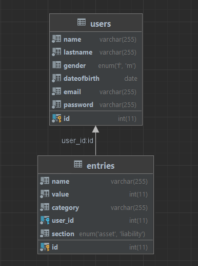

# My Net Worth

This web application project is a personal net worth calculator, which as the name implies, calculates your net worth.

## Functions
- There are 3 pages in the web application:
- The Homepage: you may login or create an account. After logging in, you may add your assets and liabilities into the respective tables, specifying their name, value and category among the given categories, and using the the total value of either group, calculates their difference which is displayed as your Net worth.
- The Statspage: you may view statistical information such as the mean, median, maximum and minimum value of your assets and liabilities as well as the distribtuion (percentage) of said items amongst themselves.
- The Searchpage: you can search for previously inputted entries. You can search for them in the searchbar and the web application will display all the matches. You may also filter the results by label (asset or liability), category (Bank account, Real estate, Loan...) and order the result either by name or value, in ascending or descending order.

## Stack Technology
- frontend: **Node.js**
- backend: **Express.js**
- integration: **Axios**
- database: **MariaDB**

## Database schema
You can put the database schema here


- 2 tables: **users** table and **entries** table
- The **primary key** of **users** is **id**
- The **primary key** of **entries** is **id**
- **email** in the **entries** table is a **unique key** (no duplicate emails)
- **entryid** is a foreign key associated with **id** from the **users** table

## To run the frontend and backend in developing mode 
cd to backend then run:
```
    node index.js
```
cd to frontend then run:
```
    npm run dev
```

## API endpoints

#### URL
`POST /login`

#### Request Body 
| Parameter | Type | Description |
|----------|:-------------:|:------|
|email|String| user's email
|password|String| user's password|


Example
```
   {
     "email" : "tedherambert@email.com",
     "password" : "Password123"
   }


```

#### Success
Response

###### Status Code
` 200`  User authentification is successful

| Parameter | Type | Description |
|----------|:-------------:|:------|
|email|String| user's email
|id|int| user's id
|firstname|String| user's firstname
|lastname|String| user's lastname
|dateofbirth|Date| user's date of birth|

Example
```
{
   "id" : 1
   "email" : "tedherambert@email.com",
   "firstname" : "Ted",
   "lastname" : "Herambert",
   "dateofbirth" : "2004-10-09",
}

```
<!-- This is the special action of your end point (for example, sending the token) -->
**note: If successful, the response will be sent with a cookie named UserToken**

### Register
`POST /register`

#### Request Body 
| Parameter | Type | Description |
|----------|:-------------:|:------|
|email|String|user's email
|password|String| user's password|
|firstname|String| user's firstname
|lastname|String| user's lastname
|dateofbirth|Date| user's date of birth|


Example
```
   {
     "email" : "tedherambert@email.com",
     "password" : "Password123",
     "firstname" : "Ted",
     "lastname" : "Herambert",
     "dateofbirth" : "2004-10-09",
   }

```

#### Success
Response

###### Status Code
` 200`  User has been created

No response body


### Get user
`GET /me`

#### Request Body 
No request body

#### Success
Response

###### Status Code
` 200`

| Parameter | Type | Description |
|----------|:-------------:|:------|
|email|String| user's email
|id|int| user's id
|firstname|String| user's firstname
|lastname|String| user's lastname
|dateofbirth|Date| user's date of birth|

Example
```
{
   "id" : 1,
   "email" : "tedherambert@email.com",
   "firstname" : "Ted",
   "lastname" : "Herambert",
   "dateofbirth" : "2004-10-09",
}

```

### Get all entries
`GET /entries`

#### Request Body 
No request body

#### Success
Response

###### Status Code
` 200`

| Parameter | Type | Description |
|----------|:-------------:|:------|
|np parameter|Array of entries| user's assets and liabilities


Entry object:
| Parameter | Type | Description |
|----------|:-------------:|:------|
|id|int| entry's id
|name|String| entry's name
|value|int| entry's value
|category|String| entry's category
|label|String| entry's label (asset or liability)
|userid|int| id of user that owns the entry


Example
```
{
   "id" : 1,
   "name" : "House#1",
   "value" : 10000,
   "category" : "Real estate",
   "label" : "asset",
   "userid" : 1
}

```


### Edit entry
`PATCH /entry`

#### Request Body 
| Parameter | Type | Description |
|----------|:-------------:|:------|
|id|int| entry's id
|name|String| entry's name
|value|int| entry's value
|category|String| entry's category
|label|String| entry's label (asset or liability)
|userid|int| id of user that created the entry


Example
```
{
   "id" : 2,
   "name" : "Bank account#1",
   "value" : 7000,
   "category" : "Bank account",
   "label" : "asset",
   "userid" : 1
}

```

#### Success
Response

###### Status Code
` 200` Updated entry successfully

| Parameter | Type | Description |
|----------|:-------------:|:------|
|id|int| entry's id
|name|String| entry's name
|value|int| entry's value
|category|String| entry's category
|label|String| entry's label (asset or liability)
|userid|int| id of user that created the entry


Example
```
{
   "id" : 2,
   "name" : "Bank account#1",
   "value" : 7000,
   "category" : "Bank account",
   "label" : "asset",
   "userid" : 1
}

```

### Add entry
`POST /entry`

#### Request Body 
| Parameter | Type | Description |
|----------|:-------------:|:------|
|name|String| new entry's name
|value|int| new entry's value
|category|String| new entry's category
|label|String| new entry's label (asset or liability)
|userid|int| id of user creating the new entry


Example
```
{
   "name" : "Debt#1",
   "value" : 5000,
   "category" : "Debt",
   "label" : "liability",
   "userid" : 1
}

```

#### Success
Response

###### Status Code
` 200` Created entry successfully

No response body


### Delete entry
`DELETE /entry`

#### Request Body 
No request body

#### Success
Response

###### Status Code
` 200` Deleted entry successfully

No response body

### Search entries
`POST /search`

#### Request Body 
No request body

#### Success
Response

###### Status Code
` 200`

| Parameter | Type | Description |
|----------|:-------------:|:------|
|np parameter|Array of entries| user's assets and liabilities that were searched for

Entry object:
| Parameter | Type | Description |
|----------|:-------------:|:------|
|id|int| entry's id
|name|String| entry's name
|value|int| entry's value
|category|String| entry's category
|label|String| entry's label (asset or liability)
|userid|int| id of user that owns the entry


Example
```
{
   "id" : 6,
   "name" : "Other#1",
   "value" : 500,
   "category" : "Other",
   "label" : "asset",
   "userid" : 1
}

```